| Nama      | Aditya Bani Isro |
| ----------- | ----------- |
| NIM     | 312010134       |
| Kelas   | TI.20.A.1        |

## Langkah langkah praktikum 7

## 1. Install XAMPP
Install XAMPP dari https://www.apachefriends.org/download.html

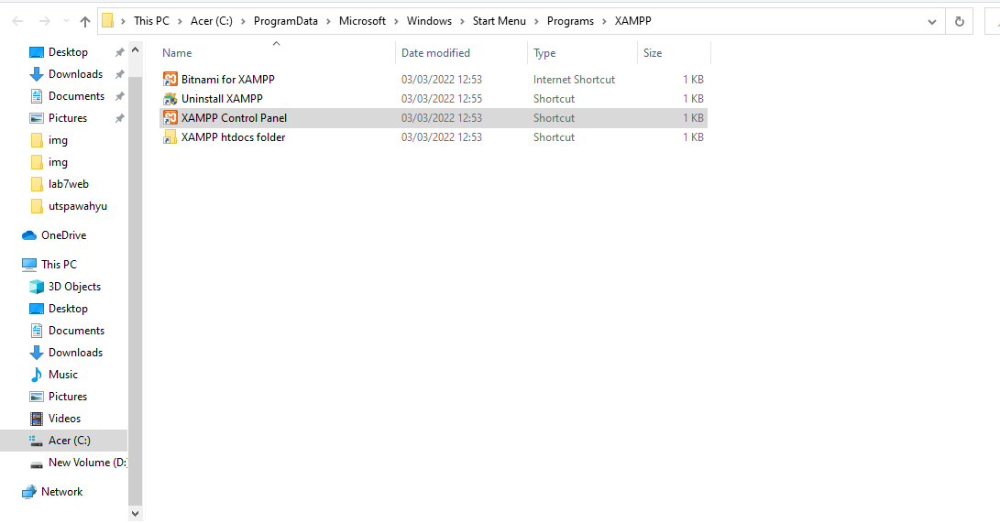

## 2. Menjalankan web server
Untuk menjalankan web server dari menu XAMPP Control

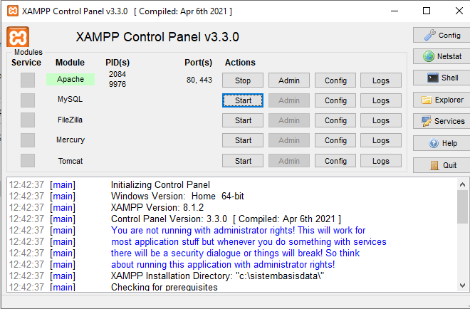
Menjalankan XAMPP dengan cara klik tombol Start pada server Apache seperti gambar diatas

## 3. Memulai PHP
Buat folder lab7_php_dasar pada root directory web server (\xampp\htdocs)

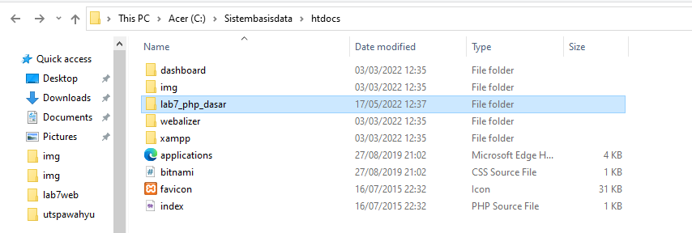

Kemudian untuk mengakses direktory tersebut pada web server dengan mengakses URL:
http://localhost/lab7_php_dasar/

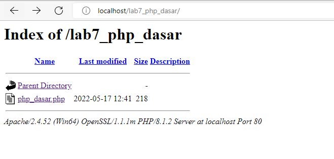

## 4. PHP Dasar
Buat file baru dengan nama php_dasar.php pada directory tersebut. Kemudian buat
kode seperti berikut.

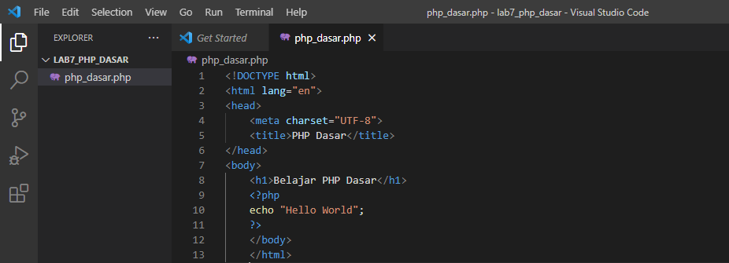

Berikut hasil run PHP Dasar
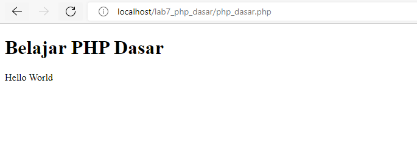

### Variable PHP
Menambahkan variable pada program.

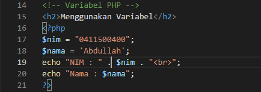

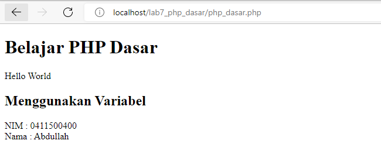

### Predefine Variable `$_GET`
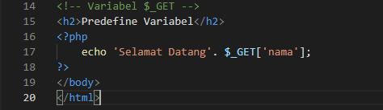

Untuk mengaksesnya gunakan URL:
http://localhost/lab7_php_dasar/php_dasar.php?nama=%20AdityaBani

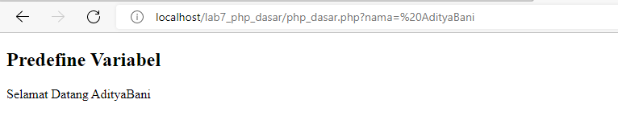

## 5. Membuat Form Input
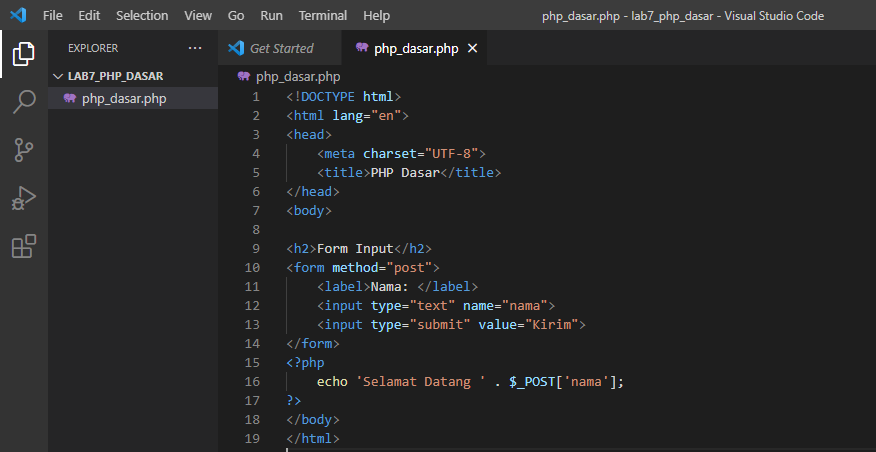

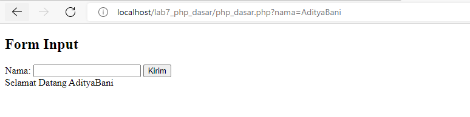

### Operator
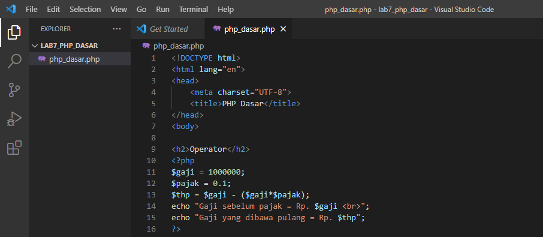

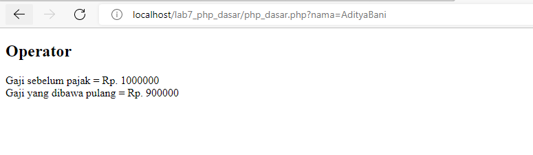

### Kondisi IF
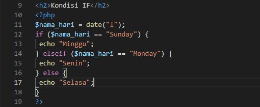

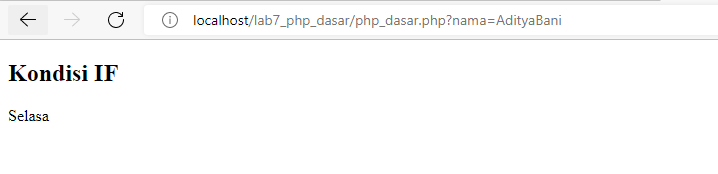

### Kondisi Switch
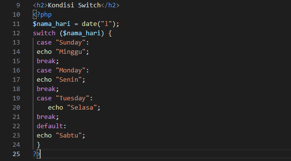

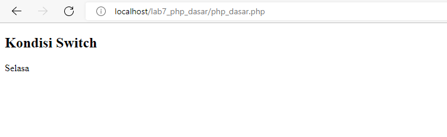

### Perulangan for
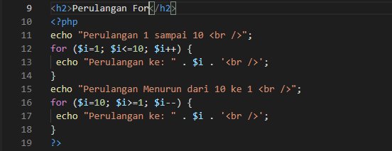

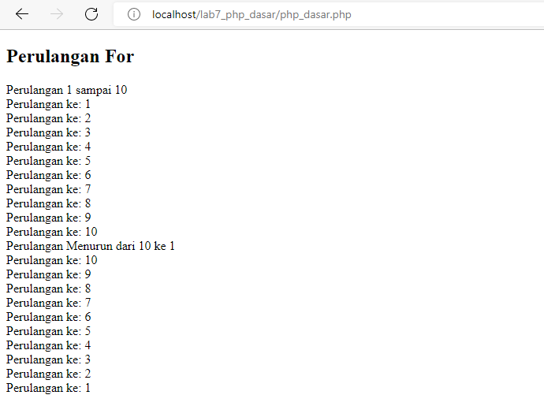

### Perulangan while
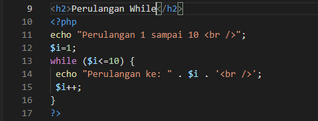

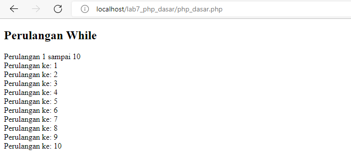

### Perulangan do while
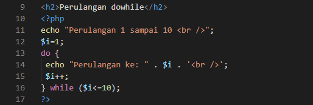

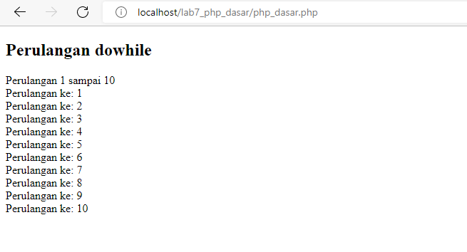

## Pertanyaan dan Tugas
Buatlah program PHP sederhana dengan menggunakan form input yang menampilkan
nama, tanggal lahir dan pekerjaan. Kemudian tampilkan outputnya dengan menghitung
umur berdasarkan inputan tanggal lahir. Dan pilihan pekerjaan dengan gaji yang
berbeda-beda sesuai pilihan pekerjaan.

## Jawab
### Pertama saya akan membuat 1 module dan 3 package

terdapat folder core yang berisi file umur.php dan gaji.php

dimana file `umur.php` untuk menampilkan output dengan menghitung
umur berdasarkan inputan tanggal lahir, 

Lalu file `gaji.php` untuk menentukan gaji yang berbeda-beda sesuai pilihan pekerjaan,

dan file `index.php` sebagai halaman utama dalam program sederhana ini.

### Menentukan umur berdasarkan tanggal lahir

Untuk menentukan umur berdasarkan tgl lahir, saya menggunakan ``date_diff()`` yang berfungsi untuk menghitung selisih waktu dengan format penulisan seperti diatas

### Menentukan gaji sesuai dengan pilihan pekerjaan

Untuk Menentukan gaji sesuai dengan pilihan pekerjaan, saya menggunakan pengkondisian ``if()`` dan untuk opsi pilihan html menggunakan type `select`. dimana jika saya memilih dokter maka gaji saya adalah 10jt /bulan, jika tidak maka saya akan memilih pilihan selanjutnya. dst sampai tidak ada pilihan yang tersisa

### Form Input

Untuk form saya menggunakan method `POST`, dan action ``$_SERVER["PHP_SELF"]`` yaitu variabel super global yang mengembalikan nama file dari skript yang sedang dieksekusi. Jadi ``$_SERVER["PHP_SELF"]`` mengirimkan data formulir yang dikirimkan ke halaman itu sendiri

### Form Output

didalam kolom tabel saya menyisipkan sintaks php ke dalam html supaya pas nanti di run akan muncul output yg sebelumnya sudah di input

untuk kolom umur dan gaji saya memanggil file php terpisah, tujuan nya agar penulisan kode terlihat lebih rapi

## Output

